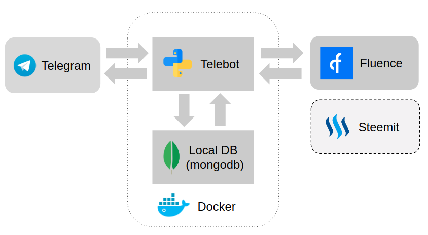

# Telegram Fluence and Steemit integration

Our App store data both in **decentralized storage and local storage**, which provide to combine advantages of this methods.  
We integrate **telegram bot**, **mongodb** and **fluence** to reach our goals.  
We learnt **fluence** app it is really useful tool for verified computations and storing data.  
In our plans is extending of functionality of out App and promoting it on social platforms.  

## Installation 

#### Telebot & mongoDB

Set your telebot token:  
`export BOT_TOKEN="your_telegram_bot_token"`

TO DO

#### Fluence
For testing with docker.  

Build project   
`cargo +nightly build --target wasm32-unknown-unknown --release`  
Run on docker   
`docker run --rm -v $(pwd)/target/wasm32-unknown-unknown/release/telebot.wasm:/code/code.wasm -p 30000:30000 fluencelabs/frun`

#### Steemit
Set your Steemit account name:  
`export STEEMIT_ACCOUNT="your_steemit_account_name"`  
Set your Steemit account post private key:  
`export STEEMIT_KEY="your_steemit_post_private_key"`  

## Usage 

`/start` - none

`/save` - save data

`/show` - show data

`/synchronize` - synchronize from the decentralized storage to the local storage

